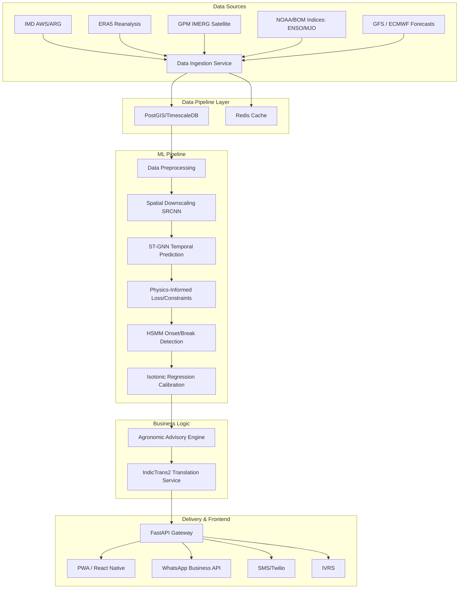

# ⚙️ Technical Approach & Architecture

## 📐 System Architecture Diagram

## 📊 Data Pipeline
A robust, automated pipeline is the backbone of VarshaMitra, ingesting heterogeneous, multi-modal data:
*   **Ground Truth:** IMD Automatic Weather Stations (AWS) and Automatic Rain Gauges (ARG) data.
*   **Gridded & Reanalysis:** ERA5 reanalysis data, IMDAA (Indian Monsoon Data Assimilation and Analysis).
*   **Satellite Imagery:** NASA GPM IMERG for precipitation, INSAT-3D/3DR TBB (Cloud Top Brightness Temperature).
*   **Macro Predictors:** ENSO, IOD, and MJO indices sourced daily via APIs from NOAA and the Australian Bureau of Meteorology (BOM).
*   **Global Forecasts:** Raw GFS and ECMWF outputs for ensemble integration.

## 🧠 Machine Learning Model Stack

Our ML architecture is highly specialized, broken down into distinct stages:

### a) Spatial Downscaling (SRCNN Variant)
Global models (GFS) provide forecasts at ~25km resolution, which is too coarse for Block-level advice. We implement a **Super-Resolution Convolutional Neural Network (SRCNN)** architecture, treating precipitation maps as low-resolution images. Incorporating High-Resolution DEM (Digital Elevation Model) as a static feature channel, we downscale these forecasts to a highly precise **~5km spatial resolution**.

### b) Temporal Prediction (ST-GNN)
The core predictive engine is a **Spatio-Temporal Graph Attention Network (ST-GAT)**. Using multi-head attention, the model dynamically weights the influence of neighboring nodes (Blocks) across time. This allows the network to track and predict the eastward/northward propagation of organized convection associated with the MJO and Monsoon Intraseasonal Oscillations (MISO).

### c) Onset & Break Regime Detection (HSMM)
Predicting exact rainfall amounts at long lead times is notoriously difficult. Instead, we reframe the problem as **Regime Detection**. We deploy a **Hidden Semi-Markov Model (HSMM)**. The latent states represent the "Active", "Break", or "Normal" monsoon phases. The HSMM's learned emission distributions take the outputs from the ST-GNN to probabilistically determine state transitions, providing confidence intervals for monsoon onset and breaks.

### d) Probability Calibration
Neural networks often output uncalibrated probabilities (they are overconfident). We apply **Isotonic Regression** on an out-of-fold validation set to calibrate the output probabilities, ensuring that when the system predicts an "80% chance of a dry spell," the event actually occurs 80% of the time.

## 🛠️ Technology Stack

*   **Languages:** Python (Backend/ML), TypeScript/JavaScript (Frontend).
*   **Machine Learning:** PyTorch, PyTorch Geometric (for ST-GNN), Scikit-learn.
*   **Backend Framework:** FastAPI (async, high throughput).
*   **Database:** PostgreSQL with PostGIS (spatial queries) and TimescaleDB (time-series meteorology data). Redis for low-latency caching of current advisories.
*   **Frontend/Mobile:** React Native (cross-platform app) or Flutter. Leaflet.js for interactive, dynamic risk maps.
*   **Infrastructure:** Docker containerization, Kubernetes for orchestration and scaling during peak monsoon traffic.

## 🌐 API Design & Edge Computing Strategy

*   **RESTful APIs:** Clean, versioned endpoints for data ingestion, querying forecasts by location `GET /api/v1/forecast/{block_id}`, and fetching advisories.
*   **WebSockets:** Maintained for real-time pushing of severe weather alerts (e.g., sudden cloudburst warnings) to the frontend applications without requiring client polling.
*   **Offline-First Edge Strategy:** The React Native/PWA application utilizes local storage (SQLite/IndexedDB). Core logic for basic advisories (based on the last synced 7-day forecast) is bundled on the edge. This ensures farmers retain access to critical guidance even when connectivity drops in remote rural areas.
