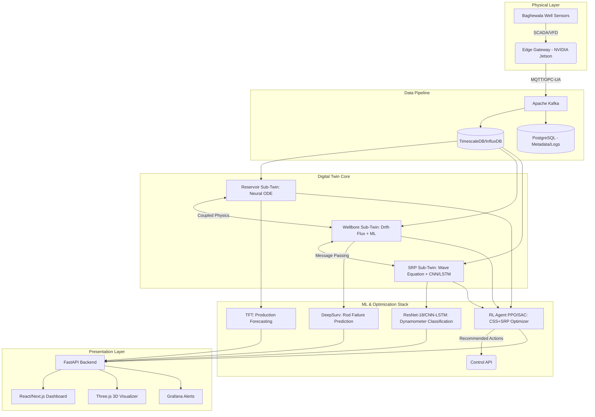

# Technical Approach

## System Architecture Diagram

## Data Pipeline
1. **Ingestion:** Data is acquired from SCADA/DCS systems and wellsite VFDs using OPC-UA or MQTT protocols.
2. **Edge Processing:** Edge devices (like NVIDIA Jetson) perform high-frequency dynamometer card preprocessing, reducing bandwidth costs.
3. **Message Broker:** Apache Kafka handles real-time streaming, ensuring fault tolerance and scalability across multiple wells.
4. **Storage:** Time-series data is stored in InfluxDB or TimescaleDB for fast querying, while relational metadata (well configurations, maintenance logs) resides in PostgreSQL.

## Digital Twin Components

### a) Reservoir Sub-Twin
- **Mechanism:** Uses a **Neural ODE** to solve coupled heat and mass transfer equations.
- **Training:** Pre-trained on historical field data and synthetic datasets generated from CMG STARS/Eclipse.
- **Function:** Predicts dynamic changes in reservoir pressure, oil saturation, temperature distribution, and viscosity near the wellbore during injection, soak, and production phases.

### b) Wellbore Sub-Twin
- **Mechanism:** Implements a drift-flux model for multiphase flow (oil/water/gas/steam).
- **Heat Loss:** Computes wellbore heat loss using Ramey's analytical method, augmented with a Neural Network to correct for localized thermal anomalies and varying casing configurations.

### c) SRP Sub-Twin
- **Mechanism:** Solves the damped wave equation to simulate rod string dynamics and compute downhole dynamometer cards from surface measurements.
- **Enhancement:** Incorporates learned friction and viscous drag models tailored specifically for the 17-19° API Baghewala heavy crude, accurately simulating phenomena like rod fall delays.

### d) Coupling Mechanism
- **Message-Passing:** At each simulation timestep, boundary conditions (pressures, temperatures, flow rates) are passed between the sub-twins, mimicking physical continuity. This graph-based coupling ensures system-wide energy and mass conservation.

## ML Model Stack
- **Production Forecasting:** **Temporal Fusion Transformer (TFT)** handles multivariate time-series forecasting to predict oil/water production rates.
- **Dynamometer Card Classification:** A **ResNet-18** architecture classifies 2D pump card images, complemented by tabular operational features to detect pump unsetting or gas interference.
- **Rod Failure Prediction:** Uses **DeepSurv** (a deep learning survival analysis model) to estimate the time-to-failure hazard function based on historical load and stress cycles.
- **CSS Optimization:** **Multi-objective Bayesian Optimization** is used to determine optimal steam injection rates, steam quality, and soak durations.
- **SRP Optimization:** A **Model Predictive Control (MPC)** setup with learned system dynamics adjusts SPM (Strokes Per Minute) to maximize fillage and avoid fluid pound.

## Tech Stack
- **Languages:** Python (AI/ML Backend), JavaScript/TypeScript (Frontend)
- **Deep Learning:** PyTorch, PyTorch Geometric
- **Backend Framework:** FastAPI
- **Databases:** InfluxDB/TimescaleDB, PostgreSQL
- **Frontend & Visualization:** React/Next.js, Three.js, Grafana
- **Infrastructure:** Docker, Kubernetes, Apache Kafka

## Edge Deployment Strategy
Given the remoteness of the Baghewala field and potential connectivity issues, critical predictive models (like the CNN-LSTM for dynamometer classification) will be deployed at the edge using NVIDIA Jetson modules or standard industrial edge PCs. This guarantees continuous real-time diagnosis and emergency pump shut-off capabilities even when cloud connectivity is lost.
